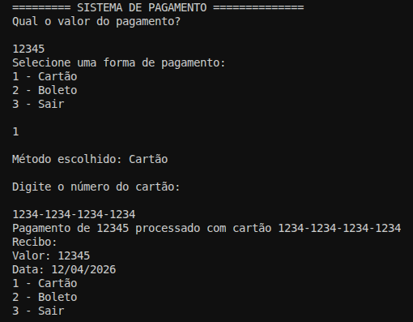
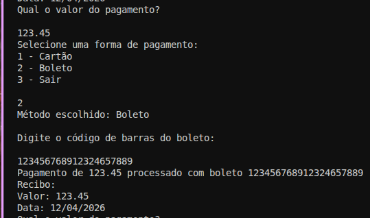

# Sistema de Pagamento em C#

[]()
[]()

Um sistema de pagamento simples implementado em C# para demonstrar os princípios de orientação a objetos e design de software. Este projeto visa fornecer uma base para sistemas de pagamento mais complexos e personalizáveis.

## Integrantes
*   Alexia Ramalho - RM
*   Enzo Real - RM557943
*   Gustavo Pasquini - RM555454
*   Hellen Aparecida - RM
*   Lorenzo Acquesta - RM

## Descrição

Este repositório contém um sistema de pagamento básico que suporta dois métodos de pagamento: cartão de crédito e boleto bancário. O sistema é projetado para ser extensível, permitindo a fácil adição de outros métodos de pagamento no futuro. A interface do usuário é simulada através do console.

## Evidências





## Tecnologias Utilizadas

*   **Linguagem:** C#
*   **.NET:** Framework .NET
*   **Design Patterns:** Abstração, Herança, Polimorfismo

## Como Instalar e Executar

1.  **Clone o repositório:**
    ```bash
    git clone https://github.com/Enzoreal100/sistema-pagamento.git
    ```
2.  **Navegue até o diretório do projeto:**
    ```bash
    cd sistema-pagamento
    ```
3.  **Restaure as dependências:**
    ```bash
    dotnet restore
    ```
4.  **Execute o projeto:**
    ```bash
    dotnet run
    ```

## Features Principais

*   **Suporte a múltiplos métodos de pagamento:** Atualmente, suporta cartão de crédito e boleto bancário.
*   **Design extensível:** Facilmente expansível para suportar outros métodos de pagamento.
*   **Interface de console simples:** Demonstração interativa no console.
*   **Orientação a Objetos:** Código bem estruturado e organizado utilizando princípios de POO.

## Estrutura de Arquivos

```
.
├── .gitignore
├── Program.cs             # Ponto de entrada da aplicação
├── interfaces
│   └── IPayment.cs        # Interface para os métodos de pagamento
├── model
│   └── MenuModel
│       ├── BasePayment.cs   # Classe base para os métodos de pagamento
│       ├── BilletPayment.cs # Implementação do pagamento por boleto
│       ├── CardPayment.cs   # Implementação do pagamento por cartão de crédito
│       └── Menu.cs          # Lógica do menu interativo
├── sistema-pagamento.csproj # Arquivo de projeto C#
└── sistema-pagamento.sln  # Arquivo de solução Visual Studio
```
